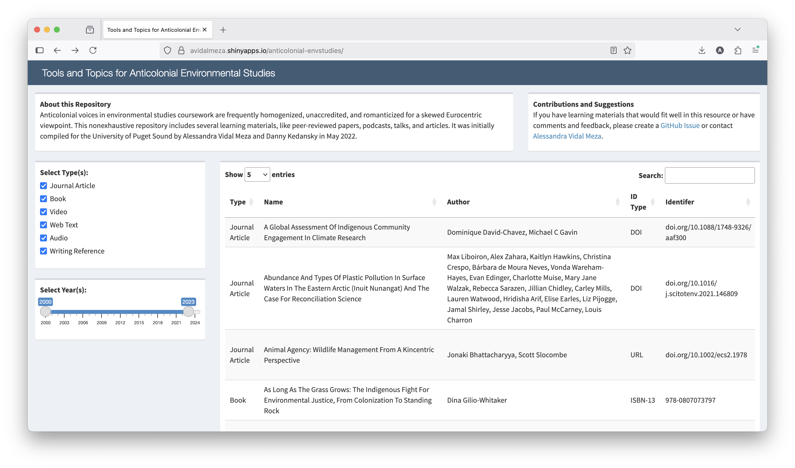

# Tools and topics for anticolonial environmental studies

Anticolonial voices in environmental studies coursework are often homogenized, unaccredited, and romanticized for a skewed Eurocentric viewpoint. This non-exhaustive repository includes several learning materials, such as peer-reviewed papers, podcasts, talks, and articles, with the aim of informing and diversifying the curriculum. 

## Contributors
This resource was initially compiled for the Department of Environmental Studies & Sciences at the University of Puget Sound in May 2022.

- Alessandra Vidal Meza, University of Puget Sound
- Daniel Kedansky, University of Puget Sound

## Acknowledgments
We would like to acknowledge Peter Hodum, Rachel DeMotts, and Andrew Strobel for helpful conversations about conceptualization.
